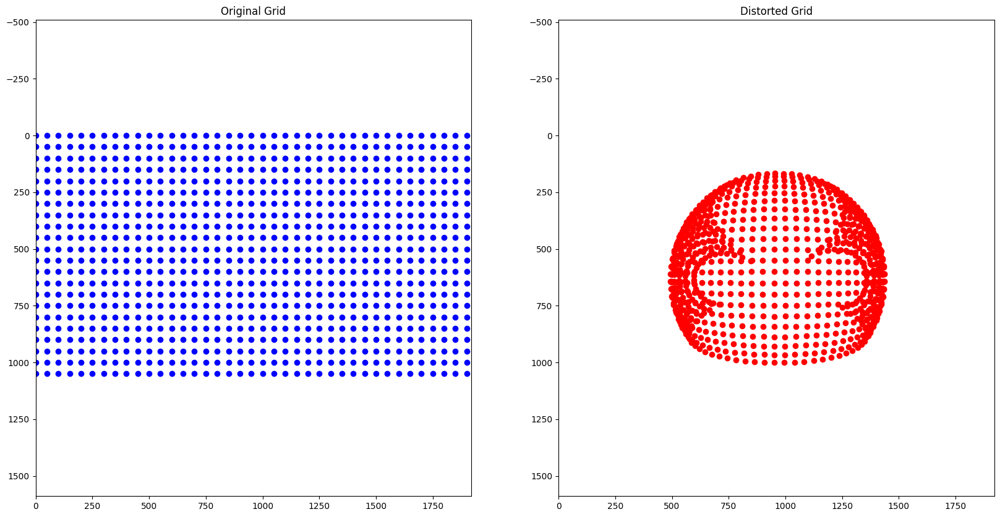

I choose KB4 model to analyze how fisheye camera system work. The parameter is given as [fx, fy, cu, cv, k1, k2, k3, k4] = [622, 622, 965, 631, -0.256, -0.0015, 0.0007, -0.0002] 

which 
fx,fy: is focal lengths  which is the scale of the image along the axis.In the given parameter set they are equal mean that the horizontal and vertical 
scales are the same

cu,cv: principal point's which is where the optical axis intersects the image sensor ideally it should be 0

k1, k2, k3, k4: radial distortion coefficients which causes straight lines to appear curve. 

## First Approch

At first , I normalized pixel coordinates and computed the radial distance using the squared norms of the normalized coordinates. Then, I applied the distortion model through the equation 1 + k1 * r2 + k2 * r4 + k3 * r6 + k4 * r4 * r2. This resulted in an incorrect visualization where the distortion appeared to wrap around, which did not accurately represent the fisheye effect.

## How I solved the problem

I updated my code to follow their model for fisheye lens distortion. Instead of just using the distance from the center of the image, I used the angle at which light hits the camera to calculate the distortion. This method accounts for how fisheye lenses bend light more at the edges. By applying these angles with the distortion coefficients provided in the paper, I was able to create a more accurate fisheye effect. The resulting image now shows how each pixel is bent by the lens, depending on its position, which is just what we expect from a fisheye camera.

## Final Result

The focal lengths maintain consistent scales on the x and y axes. The principal point's offset (cu,cv) is factored into the distortion. The negative value of k1 make the result to be barrel distortion of a fisheye lens. The coefficients k2, k3, and k4 offer subtle adjustments to fine-tune the distortion at the edges of the frame, demonstrating the intricate balance required in lens correction for wide-angle fisheye lenses.